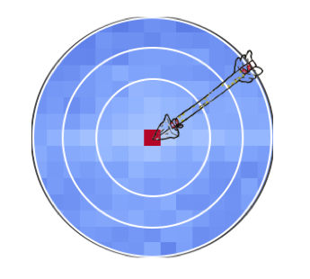

<div id="top"></div>
<!--
*** Thanks for checking out the contact-hunter. If you have a suggestion
*** that would make this better, please fork the repo and create a pull request
*** or simply open an issue with the tag "enhancement".
-->


<!-- PROJECT SHIELDS -->
<!--
*** I'm using markdown "reference style" links for readability.
*** Reference links are enclosed in brackets [ ] instead of parentheses ( ).
*** See the bottom of this document for the declaration of the reference variables
*** for contributors-url, forks-url, etc. This is an optional, concise syntax you may use.
*** https://www.markdownguide.org/basic-syntax/#reference-style-links
-->
[![Issues][issues-shield]][issues-url]
[![GPLv3 license][license-shield]][license-url]


<!-- PROJECT LOGO -->
<br />
<div align="center">
  <a href="https://github.com/Khrameeva-Lab/contact-hunter">
    
  </a>

  <h3 align="center">Contact Hunter</h3>

  <p align="center">
    <strong>Explore interactions of genomic regions with <em>Contact Hunter</em>!</strong>
   </p>
</div>


<!-- TABLE OF CONTENTS -->

<details>
  <summary>Table of Contents</summary>
  <ul>
    <li>
      <a href="#about">About</a>
    </li>
    <li>
      <a href="#getting-started">Getting Started</a>
    <ul> 
        <li><a href="#installation">Installation</a></li>
        <li><a href="#usage">Usage</a></li>
          <ul>
             <li><a href="#input-data">input data</a></li>
             <li><a href="#use-as-a-command-line-tool">use as a command line tool</a></li>
             <li><a href="#use-as-a-python-module">use as a python module</a></li>
             <li><a href="#output">output</a></li>
          </ul> 
        <li><a href="#parameters-description">Parameters description</a></li>
        <ul>
            <li><a href="#average-heatmap-generation">average heatmap generation</a></li>
            <li><a href="#resolution">resolution</a></li>
            <li><a href="#distance">distance</a></li>
            <li><a href="#fdr">fdr</a></li>
        </ul> 
   </ul>
     </li>  
        <li><a href="#contributing">Contributing</a></li>
        <li><a href="#license">License</a></li>
        <li><a href="#contact">Contact</a></li>
     
  </ul>
</details>


<!-- ABOUT THE PROJECT -->
## About 

[![Product Name Screen Shot][product-screenshot]](https://example.com)

There are many methods to investigate significant Hi-C contacts established between a particular genomic region and its neighborhood within some range of distances. One popular method was introduced by H.Won in 2016 (https://doi.org/10.1038/nature19847). Here we present a handy tool, applying this method (with minor technical differences). It allows user to obtain meaningful contacts from Hi-C map for a predefined list of genomic coordinates corresponding to SNPs, TSSs or any other features.

The package was developed to detect significant contacts from a human Hi-C data. It has not been tested on another species.


<!-- GETTING STARTED -->
## Getting Started

### Installation
Requirements
        <ul>
          <li>python 3.6+</li>
        </ul> 

Install from PyPI using pip.
  ```sh
   pip install contact-hunter
   ```
<p align="right">(<a href="#top">back to top</a>)</p>


### Usage

#### Input data

 <ul>
           <li>Hi-C map in .cool format</li> 
           <li>Tab-delimited file for genomic features to be explored. Should not contain header, 2 columns are expected: chromosome, start</li>
            <li>Tab-delimited file for background. Should not contain header, 2 columns are expected: chromosome, start</li>
        </ul> 

   The file with background can be generated based on the data you are exploring. For example, if you are going to find contacts for a list of specific SNPs it is reasonable to use a list with all the rest SNPs from the relevant GWAS study as a background. For a set of differentially expressing genes, all other TSSs can be a background. For more details read methods section in https://doi.org/10.1038/nature19847.
 <p align="right">(<a href="#top">back to top</a>)</p>


#### Use as a command line tool
run in terminal
  ```sh
   contact_hunter COOL_PATH   LOCUS_BACKGROUND   LOCUS_TEST   RESOLUTION   DISTANCE   RESULTS_FILE
```
type   _contact_hunter  -h_    in terminal to view all the parameters

#### Use as a python module
import module
  ```sh
   import contact_hunter
   ```
 use _get_contacts_ function
 
```sh
   contact_hunter.get_contacts(cool,background_locus,tested_locus,resolution,distance)
   ```
 type  _help(contact_hunter.get_contacts_) or _?contact_hunter.get_contacts_ in jupyter notebook to view all the parameters

<p align="right">(<a href="#top">back to top</a>)</p>

#### Output 
The tool returns table with 6 columns:chr     locus_with_SNPs list_tested_SNPs        interacting_locus_coord pval    p-value_critical
        <ul>
          <li>chr - chromosome</li>
          <li>bin_start - start of target bins (algorithm detects significant interactions between these and surrounding bins</li>
          <li>list_of_loci - list with the precise coordinates of features of interes (SNPs, TSSs, etc), falling to the bins</li>
          <li>interacting_locus_coord - start of significantly interacting bins</li>
          <li>pval - p-value</li>

</ul> 

Using the CLI version, you get a file with the table described above, since the output file name is a required argument.

When used as a python module, the _get_contucts_ function returns a table, but no output file is created.

<p align="right">(<a href="#top">back to top</a>)</p>

<!-- PARAMETERS DESCRIPTION -->
### Parameters description

#### Average heatmap generation

The tool has been tested on human data, the goal was to detect genomic regions interacting significantly with the list of target SNPs or a gene set TSSs. One can use the tool to explore contacts in another species with another features (for example to get contacts for particular set of ATAC-seq peaks). In this case the generation of average heatmap is recommended. The heatmap can be easily obtained with the usage of specific option. In addition to basic output it yields average heatmap around significant contacts which enables to estimate roughly the performance of the tool on users specific data. The clear enrichment in central pixel is a good sign! :)
 <ul>
          <li>add <em>--avr_heatmap</em> to command when using CLI version</li>
          <li>specify <em>plot_generate=True</em> when using as a python module</li>
 </ul> 


#### Resolution

One of the important issue is Hi-C data resolution. Everybody strives to set as small a bin size as it possible for Hi-C data, this strategy helps to more accurately annotate the resulting contacts in the subsequent analysis. But, unfortunately, using the sparse data is not appropriate here. The only thing user should rely on is the Hi-C map quality.  

#### Distance 
In accordance with the initial paper https://doi.org/10.1038/nature19847 an appropriate distance constraining the field of contacts search is ±5 Mb for human data. 

#### FDR 
The algorithm implementation includes significant contacts selection by fdr. The default fdr value is 0.01. There is a column _p-val_ in output table. These are p-values of contacts that survived the correction. Importantly, if user plans to select contacts by p-value (e.g. to consider only contacts with the lowest p-value), then this selection should be done separately for each chromosome: a single threshold should not be set. This recommendation is due to the fact that each chromosome is considered separately in the algorithm and the critical values are calculated individually.


<!-- LICENSE -->
## License

Distributed under the GPLv3 License. See <a href="https://github.com/Khrameeva-Lab/contact-hunter/blob/main/LICENSE">LICENSE</a>  for more information.

<p align="right">(<a href="#top">back to top</a>)</p>


<!-- CONTACT -->
## Contact

Anna Kononkova - a.kononkova@yandex.ru

Project Link: [https://github.com/Khrameeva-Lab/contact-hunter](https://github.com/Khrameeva-Lab/contact-hunter)

<p align="right">(<a href="#top">back to top</a>)</p>


<!-- MARKDOWN LINKS & IMAGES -->
<!-- https://www.markdownguide.org/basic-syntax/#reference-style-links -->
[issues-shield]:https://img.shields.io/github/issues/Khrameeva-Lab/contact-hunter
[issues-url]: https://github.com/Khrameeva-Lab/contact-hunter/issues 
[license-shield]: https://img.shields.io/badge/license-GPLv3-brightgreen
[license-url]: https://github.com/Khrameeva-Lab/contact-hunter/blob/main/LICENSE
[product-screenshot]: images/screenshot.png
